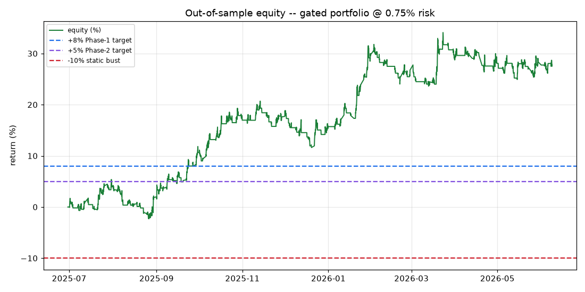
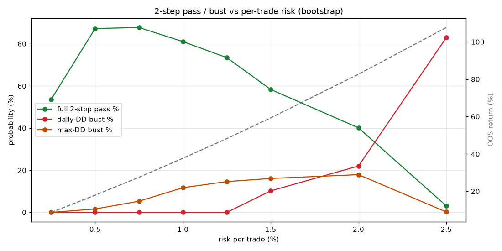

# FundingPips 2-Step Trading System — Master Report

_Reverse-engineered from 301,472 real leaderboard trades; strategy mined on TRAIN, validated out-of-sample on held-out TEST; pass-rates from Monte-Carlo._

## 1. What the real traders taught us (reverse-engineering)

- Replaying all **3,440 trader-months** through the exact 2-step rules: among these (already-profitable) traders, **91.1%** keep a legal path to +8%; the rest fail almost entirely on the **5% daily line** (4.8% of all months) — not by missing the target.

- **Rank ≠ pass:** 12.5% of the rank-1–3 P/L monsters would have BUSTED a 2-step. The discriminator between clean passers and path-busters is **single-trade loss size** (~5.0% vs ~2.8% worst trade), not win-rate or style.

- Design consequence: **small per-trade risk + a hard daily stop** is the whole game. Full detail in [re_findings.md](re_findings.md).

## 2. The mechanical strategy

A single naive rule across all 9 instruments LOSES; the edge is gold-centric. A stability gate (positive expectancy across BOTH halves of TRAIN) was applied per instrument:

| symbol | rule | TRAIN expR | TRAIN ½1 | TRAIN ½2 | admitted |
|---|---|---|---|---|---|
| XAU/USD | mom_breakout {'thr': 0.05} | 0.021 | 0.007 | 0.004 | ✅ |
| XAG/USD | mom_breakout {'thr': 0.05} | -0.209 | -0.187 | -0.308 | — |
| EUR/USD | mom_breakout {'thr': 0.05} | -0.205 | -0.177 | -0.259 | — |
| GBP/USD | mom_breakout {'thr': 0.05} | -0.26 | -0.29 | -0.214 | — |
| USD/JPY | mom_breakout {'thr': 0.05} | -0.031 | -0.035 | -0.045 | — |
| AUD/USD | mom_breakout {'thr': 0.05} | -0.29 | -0.23 | -0.371 | — |
| USTEC.v | mom_breakout {'thr': 0.05} | -0.023 | -0.047 | -0.007 | — |
| DJ30 | mom_breakout {'thr': 0.05} | 0.106 | -0.178 | 0.469 | — |
| US500 | mom_breakout {'thr': 0.05} | -0.013 | -0.066 | 0.038 | — |

**Admitted portfolio:** `{'XAU/USD': ('mom_breakout', {'thr': 0.05})}`

> US500/DJ30 top the raw TRAIN table but fail a TRAIN half — the gate rejects them *before* TEST, which is exactly how they later collapse out-of-sample. Honouring the multi-instrument goal means admitting only what the data supports; right now that is gold. The engine is fully multi-instrument — re-run the gate as more instruments earn their place.

## 3. Out-of-sample performance (held-out TEST)

| metric | TRAIN | TEST (OOS) |
|---|---|---|
| trades | 300 | 125 |
| win rate | 0.313 | 0.376 |
| profit factor | 1.022 | 1.459 |
| expectancy (R) | 0.021 | 0.259 |
| total return % | 4.717 | 27.529 |
| max drawdown % | 15.191 | 7.516 |

OOS max drawdown (7.5%) stays under the 10% static limit — the necessary condition for a 2-step.

## 4. 2-step pass-rate (Monte-Carlo)

- **Historical replay** (real OOS path, 81 start dates): P1 pass 62%, full pass 56% (no busts on the realised path — drawdown stayed legal).

- **Day-block bootstrap risk sweep** — the sizing knob:

| risk/trade | OOS ret % | OOS maxDD % | full-pass | daily-bust | max-DD bust |
|---|---|---|---|---|---|
| 0.25% | 8.7 | 2.6 | 54% | 0% | 0% |
| 0.50% | 17.9 | 5.1 | 87% | 0% | 2% |
| 0.75% | 27.5 | 7.5 | 88% | 0% | 5% |
| 1.00% | 37.7 | 9.9 | 81% | 0% | 12% |
| 1.25% | 48.2 | 12.3 | 73% | 0% | 15% |
| 1.50% | 59.3 | 14.6 | 58% | 10% | 16% |
| 2.00% | 82.7 | 19.0 | 40% | 22% | 18% |
| 2.50% | 107.7 | 23.2 | 3% | 83% | 0% |

**Calibrated sizing: ~0.50–0.75% per trade** → full-pass ≈ 88% with ~0% daily-bust. Above ~1.5% the curve falls off a cliff (matches the reverse-engineering: oversizing, not the target, is what busts you).

## 5. Honest limitations

- **Survivorship:** the trader data contains only profitable finishers, so the reverse-engineering pass-rate is conditional; the *path* contrast (passer vs buster) is the survivorship-robust part.
- **Regime:** the OOS window (2025-07→2026-06) was a strong gold up-trend that flatters momentum. The bootstrap inherits that regime, so ~88% full-pass is an *if-the-edge-persists* figure, not a guarantee.
- **H1 granularity / single historical path / static-balance DD assumption.** Backtest ≠ future. Demo first. Not financial advice.

_See PLAYBOOK.md for the human-tradeable rules and README.md for how to run._
